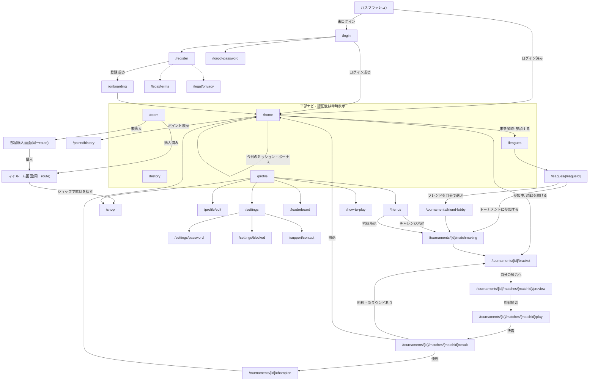

# 16. 設計書 — MIND ARENA

> このドキュメントは `docs/00〜15` (初期構想時点のMVP設計) を土台に、その後追加された機能
> (フレンド対戦・ショップ・実績・デイリーボーナス/ミッション・法務ページ・ブロック機能 等) を
> 反映した **現時点の実装に基づく最新の設計書** です。技術スタック・画面構成・画面遷移・ER図・
> 機能説明をこの1ファイルにまとめています。

## 目次

1. [プロジェクト概要](#1-プロジェクト概要)
2. [技術スタック](#2-技術スタック)
3. [アーキテクチャ](#3-アーキテクチャ)
4. [画面一覧](#4-画面一覧)
5. [画面遷移図](#5-画面遷移図)
6. [ER図](#6-er図)
7. [機能説明](#7-機能説明)
8. [主要API一覧](#8-主要api一覧)

---

## 1. プロジェクト概要

**MIND ARENA** は、スマートフォン縦画面専用(モバイルファースト/ポートレート固定)の
心理戦バトル・トーナメントブラウザゲーム。プレイヤーは1〜3分で決着する短い心理戦ミニゲームを
通じて相手の意図を読み合い、最大32人参加のシングルエリミネーション・トーナメントを勝ち上がって
ポイントを獲得し、リーグを昇格させ、プロフィールを育てていく。

- オリジナル作品(既存作品のキャラクター・名称・ルールを流用しない)
- 勝敗・ポイント付与はすべてサーバー側が正とする(クライアントの自己申告を信用しない設計)
- 新しい心理戦ゲーム・リーグ・BOT・ショップアイテムなどを、トーナメント/プロフィールのコアロジックを
  変更せずに追加できるプラグイン的な構成

## 2. 技術スタック

| レイヤー | 採用技術 |
|---|---|
| フロントエンド | Next.js 16 (App Router) + React 19 + TypeScript + Tailwind CSS v4 |
| UIコンポーネント | 自作の shadcn/ui 風プリミティブ (`src/components/ui`) + Radix UI (`Dialog`/`Tabs`/`Progress`/`Label` 等) |
| アイコン | lucide-react |
| クライアント状態 | React state / Zustand (UI・セッション状態)。ゲーム結果などの「真実」は常にサーバー側が権威 |
| フォーム | React Hook Form + Zod (バリデーション) |
| バックエンド | Next.js Route Handlers (`src/app/api/**/route.ts`) |
| ORM / DB | Prisma 7 + PostgreSQL (Neon想定) |
| 認証 | Auth.js (NextAuth v5, Credentials Provider) + bcrypt によるパスワードハッシュ、ユーザー名 or メールでログイン、JWTセッション |
| テスト | Vitest (単体/結合テスト)、Playwright (E2E・ブラウザ検証) |
| Lint/Format | ESLint (eslint-config-next) / Prettier |
| デプロイ想定 | Vercel (アプリ) + Neon Postgres (DB) |

## 3. アーキテクチャ

レイヤードアーキテクチャを採用し、依存の向きを一方向に保っている。

```
src/
├─ app/                  … Next.js App Router (画面 = page.tsx, API = api/**/route.ts)
├─ components/           … UIコンポーネント (ui / common / layout / providers / home 等)
├─ features/             … ユースケース単位のサービス層 (auth, tournaments, games, shop, ...)
│                          — API route から呼ばれる「アプリケーション層」
├─ domain/                … フレームワーク非依存のドメインロジック
│  ├─ entities/            (ドメインの型)
│  ├─ enums/               (TournamentStatus など)
│  ├─ services/            (純粋関数: 勝敗判定・ポイント計算・実績判定・BOT思考 等、単体テストしやすい)
│  └─ interfaces/           (PsychologicalGame プラグインIF など)
├─ infrastructure/        … 外部システムとの接続
│  ├─ auth/                 (Auth.js設定)
│  ├─ database/             (Prisma client)
│  └─ repositories/         (Prisma を用いたデータアクセス、テーブルごとに1リポジトリ)
├─ config/                … マスタデータ (リーグ・ゲーム・実績・ショップ商品・称号・BOT等)。
│                            ハードコードせずここを直せば内容を変更できる
├─ lib/                   … 汎用ユーティリティ (バリデーションスキーマ, APIクライアント, エラー型 等)
└─ generated/prisma/       … `prisma generate` で自動生成されるPrisma Client
```

依存の向き: `app` → `features` → `domain` / `infrastructure` → `config`。
`domain/services` はDBやNext.jsに依存しない純粋関数として実装し、Vitestで単体テストしている。

心理戦4種は `PsychologicalGame` という共通インターフェース (`domain/interfaces`) を実装するプラグインとして
`features/games/<game-id>` 配下に追加されており、トーナメント進行エンジン (`features/tournaments`) は
このインターフェース越しにしかゲームを知らない。これにより新しい心理戦ゲームの追加時に
トーナメント側のコードを変更する必要がない。

## 4. 画面一覧

全30画面。認証必須画面は原則すべて下部ナビ (ホーム/リーグ/部屋/戦績/プロフィール) を持つ
`AppScreen nav` レイアウトを共有する。トーナメントへの参加導線はリーグ画面に統合されており、
専用の「トーナメント」タブは存在しない(§5参照)。

### 4.1 認証・オンボーディング

| パス | 画面名 | 概要 | 認証 |
|---|---|---|---|
| `/` | スプラッシュ | ロゴ表示後、ログイン状態に応じ `/home` または `/login` へ自動遷移 | 不要 |
| `/login` | ログイン | ユーザー名 or メールアドレス + パスワードでログイン | 不要 |
| `/register` | 新規登録 | ユーザー名/メール/パスワード登録、利用規約・プライバシーポリシー同意 | 不要 |
| `/forgot-password` | パスワードを忘れた | パスワード再設定導線 | 不要 |
| `/onboarding` | チュートリアル | 登録直後に表示される遊び方の簡易説明 | 必要 |

### 4.2 ホーム・トーナメント・対戦

| パス | 画面名 | 概要 | 認証 |
|---|---|---|---|
| `/home` | ホーム | 豪華演出付きプロフィール要約カード(保有ポイント・次のリーグ進捗・最高到達リーグと到達日・勝率/総対戦数)、デイリーボーナス、今日のミッション、トーナメント再開/参加導線(未参加時は`/leagues`へ)、総勝利数/連勝記録/最高到達リーグの強化ステータスタイル、最近の対戦結果、お知らせ | 必要 |
| `/tournaments/friend-lobby` | フレンド対戦ロビー | 特定リーグでフレンドを招待してから開始するトーナメント募集画面 | 必要 |
| `/tournaments/[id]/matchmaking` | マッチメイキング中 | 参加者(人間+BOT)が揃うのを待つ演出画面 | 必要 |
| `/tournaments/[id]/bracket` | トーナメント表 | 現在のブラケット(対戦表)と自分の次の試合への導線を表示 | 必要 |
| `/tournaments/[id]/matches/[matchId]/preview` | 対戦プレビュー | 対戦相手・ゲームルールの確認画面(下部ナビなし=集中モード) | 必要 |
| `/tournaments/[id]/matches/[matchId]/play` | 対戦プレイ | 心理戦本体(宣言→ロックイン→ラウンド結果演出を反復) | 必要 |
| `/tournaments/[id]/matches/[matchId]/result` | 対戦結果 | 勝敗演出、獲得ポイント表示、次ラウンドまたはブラケットへ | 必要 |
| `/tournaments/[id]/champion` | 優勝演出 | トーナメント優勝時の祝賀演出、賞金・トロフィー獲得表示 | 必要 |

### 4.3 成長・収集要素

| パス | 画面名 | 概要 | 認証 |
|---|---|---|---|
| `/leagues` | リーグ一覧 | 全10リーグの一覧、到達状況表示。下部ナビ「リーグ」タブの遷移先 | 必要 |
| `/leagues/[leagueId]` | リーグ詳細・参加 | 個別リーグの詳細(必要ポイント・報酬・使用ゲーム・BOT難易度)に加え、フレンド招待導線と「トーナメントに参加する」ボタンを統合(旧`/tournaments/join?league=`を統合) | 必要 |
| `/leaderboard` | ランキング | 全体/自リーグのポイントランキング | 必要 |
| `/points/history` | ポイント履歴 | 獲得/減少したポイントの取引履歴一覧(理由・増減・残高)。ホームのプロフィールカードから遷移 | 必要 |
| `/shop` | ショップ | 「プロフィール」(背景・バッジ・称号)と「部屋・家具」の2タブ。賞金(prizeCurrency)で購入 | 必要 |
| `/room` | 部屋購入・マイルーム | 未購入時は部屋購入画面、購入済みならマイルーム画面(家具の配置・移動・回転・撤去)を直接表示。下部ナビ「部屋」タブの遷移先 | 必要 |
| `/history` | 戦績 | 過去の対戦履歴一覧 | 必要 |
| `/how-to-play` | 遊び方 | 4つの心理戦ゲームのルールをまとめたリファレンス | 必要 |

### 4.4 プロフィール・フレンド

| パス | 画面名 | 概要 | 認証 |
|---|---|---|---|
| `/profile` | プロフィール | 表示名/称号/リーグ/フレーム/賞金(現在・生涯)/トロフィーケース/実績カタログ(通常+隠し実績)/成績推移等 | 必要 |
| `/profile/edit` | プロフィール編集 | 表示名・アバター・装備コスメ(フレーム/背景/バッジ/称号)の変更 | 必要 |
| `/friends` | フレンド | フレンド一覧・検索・申請/承認、対戦チャレンジ、トーナメント招待の一覧 | 必要 |

### 4.5 設定・アカウント

| パス | 画面名 | 概要 | 認証 |
|---|---|---|---|
| `/settings` | 設定 | 音/振動/BOT表記/モーション等のトグル、パスワード変更・ブロック一覧・お問い合わせへの導線、退会 | 必要 |
| `/settings/password` | パスワード変更 | 現在のパスワード確認のうえ変更 | 必要 |
| `/settings/blocked` | ブロック一覧 | ブロック中ユーザーの一覧・解除 | 必要 |

### 4.6 法務・サポート

| パス | 画面名 | 概要 | 認証 |
|---|---|---|---|
| `/legal/terms` | 利用規約 | 利用規約全文 | 不要 |
| `/legal/privacy` | プライバシーポリシー | 個人情報の取り扱い | 不要 |
| `/legal/tokushoho` | 特定商取引法に基づく表記 | 資金決済/景品表示法対応の法定表記 | 不要 |
| `/support/contact` | お問い合わせ | カテゴリ選択+本文送信(`Inquiry`テーブルに保存、メール送信基盤は未設定) | 不要 |

## 5. 画面遷移図



**画面遷移の設計原則(復帰状態の再構成)**

対戦中にアプリを閉じて再度開いた場合でも、常にサーバー側の状態から「今いるべき画面」を
再計算する (`resolveResumeState` / `src/features/tournaments/resume.ts`)。クライアント側の
一時状態を信用しないことで、リロードや複数タブでも矛盾が起きない。

- トーナメント未参加 → `/home`
- 参加者募集中/準備完了 → `matchmaking`
- 進行中で自分の試合がまだ組まれていない → `bracket`
- 自分の試合はあるがゲームセッション未開始 → `preview`
- ゲームセッション進行中 → `play`
- トーナメント完了 かつ 自分が優勝者 → `champion`
- 敗退済み/優勝者以外の完了 → `home` (これ以上進める試合がないため)

## 6. ER図

Prisma スキーマ (`prisma/schema.prisma`) 作成時点の主要25モデルの関係を示す。主要フィールドのみ抜粋。

> ⚠️ 未反映: その後追加された `RoomType` / `UserRoom` / `ShopFurnitureItem` / `UserOwnedFurniture` /
> `RoomFurniturePlacement`(マイルーム機能、計5モデル)と、`PointTransaction.round` 列・
> `PointReason` の `ROUND_*_ELIMINATION` 系の値(ベスト4未到達ペナルティ)、および
> `PlayerProfile.highestLeagueId` / `highestLeagueAt`(最高到達リーグの記録、`League` への
> 2本目のリレーション)は、この節の図にはまだ含まれていない(スキーマ上には存在する)。
> 次回この節を更新する際に反映すること。

```mermaid
erDiagram
    USER ||--o| PLAYER_PROFILE : "1対1"
    USER ||--o{ INQUIRY : "任意で紐付け"

    PLAYER_PROFILE }o--|| LEAGUE : "所属リーグ"
    PLAYER_PROFILE ||--o{ POINT_TRANSACTION : "ポイント履歴"
    PLAYER_PROFILE ||--o{ PLAYER_GAME_STATS : "ゲーム別成績"
    PLAYER_PROFILE ||--o{ PLAYER_ACHIEVEMENT : "実績解除"
    PLAYER_PROFILE ||--o{ TOURNAMENT_PARTICIPANT : "大会参加"
    PLAYER_PROFILE ||--o{ LEAGUE_TROPHY : "リーグ別優勝トロフィー"
    PLAYER_PROFILE ||--o{ COSMETIC_PURCHASE : "ショップ購入履歴"
    PLAYER_PROFILE ||--o{ DAILY_MISSION_CLAIM : "デイリーミッション受取"
    PLAYER_PROFILE ||--o{ FRIENDSHIP : "フレンド関係(送信/受信)"
    PLAYER_PROFILE ||--o{ FRIEND_CHALLENGE : "対戦チャレンジ(送信/受信)"
    PLAYER_PROFILE ||--o{ TOURNAMENT_INVITE : "大会招待(送信/受信)"
    PLAYER_PROFILE ||--o{ BLOCK : "ブロック(する/される)"

    LEAGUE ||--o{ TOURNAMENT : "開催リーグ"
    LEAGUE ||--o{ LEAGUE_TROPHY : "獲得トロフィー"

    TOURNAMENT ||--o{ TOURNAMENT_PARTICIPANT : "参加者"
    TOURNAMENT ||--o{ TOURNAMENT_MATCH : "各対戦"
    TOURNAMENT ||--o{ TOURNAMENT_INVITE : "招待"
    TOURNAMENT ||--o| FRIEND_CHALLENGE : "1対1チャレンジ元"

    TOURNAMENT_PARTICIPANT }o--o| PLAYER_PROFILE : "人間の場合"
    TOURNAMENT_PARTICIPANT }o--o| BOT_PROFILE : "BOTの場合"
    TOURNAMENT_PARTICIPANT ||--o{ GAME_ACTION : "自分の行動ログ"
    TOURNAMENT_PARTICIPANT ||--o{ TOURNAMENT_MATCH : "player1/player2/winner"

    TOURNAMENT_MATCH }o--|| GAME_TYPE : "使用する心理戦"
    TOURNAMENT_MATCH ||--o| GAME_SESSION : "進行状態"
    TOURNAMENT_MATCH ||--o| MATCH_RESULT : "確定結果"

    GAME_SESSION ||--o{ GAME_ACTION : "宣言/ロックイン等の行動"
    GAME_TYPE ||--o{ PLAYER_GAME_STATS : "ゲーム別成績集計"

    ACHIEVEMENT ||--o{ PLAYER_ACHIEVEMENT : "解除記録"
    COSMETIC_ITEM ||--o{ COSMETIC_PURCHASE : "購入記録"

    USER {
        string id PK
        string username UK
        string email UK
        string passwordHash
        datetime deletedAt "退会時に設定"
    }

    PLAYER_PROFILE {
        string id PK
        string userId FK
        string displayName
        int totalPoints "リーグ昇格の基準"
        int prizeCurrency "ショップで使える賞金"
        int lifetimePrizeCurrency "生涯獲得賞金"
        string currentLeagueId FK
        int totalMatches
        int totalWins
        int currentWinStreak
        int bestWinStreak
        int tournamentWins
        int loginBonusStreak
        datetime lastLoginBonusClaimedAt
        string dailyMissionDate "JST日付キー"
        int dailyMatchesPlayed
        int dailyWins
        string selectedTitleId
        string selectedFrameId
        string selectedBackgroundId
        string selectedBadgeId
    }

    LEAGUE {
        string id PK
        string code UK
        string displayName
        int requiredPoints
        float rewardMultiplier
        int championReward
        string botDifficulty
        int displayOrder
    }

    GAME_TYPE {
        string id PK
        string code UK
        string name
        int minPlayers
        int maxPlayers
        json configuration
    }

    BOT_PROFILE {
        string id PK
        string name
        string personality
        string difficulty
        int judgment
        int deception
        int observation
        int riskTolerance
    }

    TOURNAMENT {
        string id PK
        string leagueId FK
        string status
        int maxPlayers
        int currentRound
        string winnerParticipantId
    }

    TOURNAMENT_PARTICIPANT {
        string id PK
        string tournamentId FK
        string playerId FK "human時のみ"
        string botId FK "bot時のみ"
        string type "HUMAN/BOT"
        int seed
        string status
        int finalPlacement
    }

    TOURNAMENT_MATCH {
        string id PK
        string tournamentId FK
        int round
        string player1ParticipantId FK
        string player2ParticipantId FK
        string winnerParticipantId FK
        string gameTypeId FK
        string status
    }

    GAME_SESSION {
        string id PK
        string tournamentMatchId FK UK
        string status
        int currentRound
        json state "ゲーム固有の進行状態"
    }

    GAME_ACTION {
        string id PK
        string gameSessionId FK
        string participantId FK
        int round
        string actionType "宣言/ロックイン等"
        json actionData
    }

    MATCH_RESULT {
        string id PK
        string tournamentMatchId FK UK
        string winnerParticipantId
        int player1Score
        int player2Score
        json resultData
    }

    POINT_TRANSACTION {
        string id PK
        string playerProfileId FK
        int amount
        string reason "CHAMPION/DAILY_BONUS等"
        int balanceBefore
        int balanceAfter
    }

    PLAYER_GAME_STATS {
        string id PK
        string playerProfileId FK
        string gameTypeId FK
        int matches
        int wins
    }

    ACHIEVEMENT {
        string id PK
        string code UK
        string conditionType
        int conditionValue
        json rewardData
    }

    PLAYER_ACHIEVEMENT {
        string id PK
        string playerProfileId FK
        string achievementId FK
        datetime unlockedAt
        datetime notifiedAt
    }

    LEAGUE_TROPHY {
        string id PK
        string playerProfileId FK
        string leagueId FK
        int count
    }

    COSMETIC_ITEM {
        string id PK
        string code UK
        string category "FRAME/TITLE/BACKGROUND/BADGE"
        int requiredPoints
        int price "ショップ価格(nullなら非売品)"
    }

    COSMETIC_PURCHASE {
        string id PK
        string playerProfileId FK
        string cosmeticItemId FK
    }

    FRIENDSHIP {
        string id PK
        string requesterId FK
        string addresseeId FK
        string status "PENDING/ACCEPTED"
    }

    FRIEND_CHALLENGE {
        string id PK
        string challengerId FK
        string opponentId FK
        string status
        string tournamentId FK UK "2人用トーナメント"
    }

    TOURNAMENT_INVITE {
        string id PK
        string tournamentId FK
        string inviterId FK
        string inviteeId FK
        string status
    }

    BLOCK {
        string id PK
        string blockerId FK
        string blockedId FK
        string reason
    }

    DAILY_MISSION_CLAIM {
        string id PK
        string playerProfileId FK
        string missionCode
        string claimedForDate "JST日付キー"
    }

    ANNOUNCEMENT {
        string id PK
        string title
        string body
        bool isActive
    }

    INQUIRY {
        string id PK
        string userId FK "任意"
        string category
        string email
        string message
    }
```

## 7. 機能説明

### 7.1 認証・アカウント

- **登録/ログイン/ログアウト**: Auth.js (Credentials Provider)。ユーザー名またはメールアドレス +
  パスワード(bcryptハッシュ)でログイン。セッションはJWT方式。
- **退会**: 論理削除(`User.deletedAt`)。ユーザー名/メール/パスワードはスクラブして再登録可能な状態にする一方、
  対戦履歴・フレンド関係の整合性を保つため行自体は残す。
- **パスワード変更**: 現パスワード確認のうえ更新。
- **ブロック/通報**: 一方向レコード (`Block`) だが、対戦招待・フレンド申請・検索結果など
  双方向で相互作用をブロックする。

### 7.2 トーナメント・対戦システム

- **トーナメント参加**: リーグを選んで参加すると、最大32人になるまで即座にBOTで自動補充される
  (`features/tournaments/join.service.ts`)。友達を誘いたい場合はフレンド招待を送ることができ、
  招待が保留中の間はBOT補充を一時停止して同じブラケットに友達を迎え入れられる。
- **フレンド対戦(1対1チャレンジ)**: `FriendChallenge` を介して、通常のブラケット/マッチ/セッション/
  ポイント機構を再利用した2人用トーナメント(1回戦=決勝)として実行される。
- **シングルエリミネーション・ブラケット**: 32人制、各ラウンドの勝者のみが勝ち上がる。
- **マッチ進行**: 各対戦は `GameSession`(進行中の状態をJSONで保持) と、決着後に確定する
  `MatchResult` で構成される。プレイヤーの各行動(宣言・ロックイン等)は `GameAction` として
  逐一記録され、不正なクライアント値を防ぐためサーバー側の判定ロジックのみが勝敗を決定する。
- **復帰(レジューム)機構**: `resolveResumeState` がサーバー状態から現在地を再計算するため、
  途中離脱・リロード・複数端末アクセスでも矛盾なく続きから再開できる(詳細は§5参照)。
- **優勝演出**: トーナメント優勝時に専用の祝賀画面 (`/champion`) で賞金・トロフィーを表示。

### 7.3 4つの心理戦ゲーム

いずれも「宣言(相手にも見える意思表示、嘘でもよい)」→「相手の宣言を見た上での最終選択(ロックイン)」
という共通の駆け引き構造を持つ、2人対戦・複数ラウンド制のミニゲーム。

| ゲーム | 概要 | ラウンド数 |
|---|---|---|
| TRUST OR BETRAY | 「信頼」か「裏切り」を選び合う。信頼×信頼は両者+1、信頼×裏切りは裏切り側+2/信頼側0、裏切り×裏切りは両者-1 | 3 |
| NUMBER BLUFF | 1〜9の数字を選び定型文で宣言、相手の宣言を「信じる/疑う」でブラフを読み合う | 3 |
| MINORITY CHOICE | A/Bを選び、自分・相手・観衆(BOT集団)の中で少数派になった側が得点する心理戦 | 3 |
| FINAL PREDICTION | 「攻撃/防御/見破る」の三すくみを宣言と読み合いで制する | 5 |

BOTは性格(RANDOM/CAUTIOUS/AGGRESSIVE/BETRAYER/PATTERN/ANALYST)と判断力・欺瞞・観察力・
リスク許容度・記憶力・ランダム性のパラメータを持ち、リーグの難易度に応じて強さが変化する
(`features/bots`)。

### 7.4 ポイント・リーグシステム

- 対戦の各ラウンド突破・優勝・準優勝でポイント(`totalPoints`)を獲得し、`PointTransaction` に
  増減理由付きで記録される(残高スナップショット付きの追記型台帳)。
- 10段階のリーグ(ブロンズ〜マインドキング、必要ポイント0〜75,000)を、ポイント到達で自動昇格。
  リーグごとに報酬倍率・BOTの強さ・専用の演出(グラデーション/グロー/シマー等の「豪華さ」レベル)が変化する。
- リーグ優勝で `LeagueTrophy` が記録され、繰り返し優勝すると回数がカウントされる。

### 7.5 賞金・ショップ

- トーナメント優勝で `prizeCurrency`(賞金)を獲得。これはポイントとは独立した「使えるお金」で、
  ショップでの購入にのみ消費される。
- `lifetimePrizeCurrency`(生涯獲得賞金)は使っても減らない累計値としてプロフィール画面に表示。
- ショップでは背景・バッジ等のコスメティックアイテムを賞金で購入し、プロフィールに装備できる。
  フレーム・称号の一部はポイント到達による無料自動解放、一部は購入制。

### 7.6 やり込み要素

- **実績システム**: 計45種類。通算対戦数・勝利数・連勝・決勝進出・優勝回数・トーナメント参加数・
  全ゲーム制覇・勝率・到達リーグ(10リーグそれぞれに1つ)・ログインボーナス連続日数・生涯獲得賞金
  などの条件で自動解除。プロフィール画面では**ロック中の実績も含めた全カタログ**を進捗バー付きで表示。
- **隠れ実績**: 16種類(無敗の伝説/戦いの求道者/百勝の証/常勝街道/止まらぬ快進撃/決勝の顔/
  覇者の中の覇者/覇道を極めし者/百戦錬磨/闘技場の主/見切り抜く眼/エンペラー到達/レジェンド到達/
  頭脳の探求者/皆勤の一週間/賞金王への道)。ロック中は名前・説明・進捗をサーバー側から一切返さず
  「？？？ 隠し実績」とだけ表示し、実際に解除した瞬間に初めて正体が明らかになる。
- **デイリーログインボーナス**: JST基準の日次連続ログインで7日サイクルの報酬(ポイント/一部の日は賞金も)。
  1日でも空けるとストリークがリセットされる。
- **今日のミッション**: 「ログインボーナス受取」「対戦を1回行う」「対戦に1回勝利する」の3種。
  日付が変わったらDBに書かれた日付キーとの不一致で自動的に未達成扱いへ戻る(cronジョブ不要の
  遅延リセット方式)。受取はDBのユニーク制約による競合安全な実装で、二重受取を防止。

### 7.7 ソーシャル

- **フレンド**: ユーザー名検索→申請→承認の一般的なフレンド機構。
- **対戦チャレンジ**: フレンドに1対1の対戦を申し込み、承諾で即座に2人用トーナメントが開始。
- **トーナメント招待**: 通常のリーグ参加時、同じ/より上位のリーグのフレンドを同じブラケットに誘える。
- **ブロック**: 双方向にあらゆる接点(申請・招待・検索結果)を遮断する。

### 7.8 運営・法務

- お知らせ (`Announcement`) をホーム画面に表示。
- 利用規約・プライバシーポリシー・特定商取引法に基づく表記の法定ページ。
- お問い合わせフォーム(送信内容は `Inquiry` テーブルに保存。現状メール送信基盤は未接続のため
  運営側での手動確認を想定)。

### 7.9 設定

- サウンド/BGM/振動/モーション低減/対戦相手のBOT表記、といった体験系トグル。
- パスワード変更・ブロック一覧・お問い合わせ・退会への導線。

## 8. 主要API一覧

Next.js Route Handler (`src/app/api/**/route.ts`) として実装。認証が必要なエンドポイントは
セッションのuserIdをもとに常にサーバー側で本人確認する。

| 分類 | 代表的なエンドポイント |
|---|---|
| 認証 | `POST /api/auth/register`, `/api/auth/[...nextauth]` (NextAuth) |
| アカウント | `POST /api/account/change-password`, `POST /api/account/deactivate` |
| トーナメント | `POST /api/tournaments/join`, `GET /api/tournaments/resume`, `GET/POST /api/tournaments/[id]/*` |
| 対戦 | `GET /api/matches/[matchId]/preview`, `POST /api/matches/[matchId]/session/actions`, `GET /api/matches/[matchId]/result` |
| プロフィール | `GET /api/profile/me`, `/achievements`, `/game-stats`, `/history`, `/win-rate-trend`, `PATCH /settings` `/cosmetics` `/display-name` |
| ポイント | `GET /api/points/history`(カーソルページング) |
| リーグ/ランキング | `GET /api/leagues`, `/api/leagues/[leagueId]`, `/api/leaderboard` |
| ショップ | `GET /api/shop`, `POST /api/shop/purchase`, `POST /api/shop/equip` |
| デイリー | `GET/POST /api/daily-bonus`, `/api/daily-bonus/claim`, `/api/daily-missions`, `/api/daily-missions/claim` |
| フレンド | `GET/POST /api/friends`, `/requests`, `/challenges`, `/blocked`, `/search` |
| サポート | `POST /api/support/inquiries` |

---

*関連資料: `docs/00_PROJECT_OVERVIEW.md`〜`docs/15_FUTURE_ROADMAP.md`(初期MVP設計時のドキュメント群)。
本ドキュメントは実装追従版として `docs/16_DESIGN_DOCUMENT.md` に独立して置き、今後大きな機能追加が
あった場合はここを更新する。*
